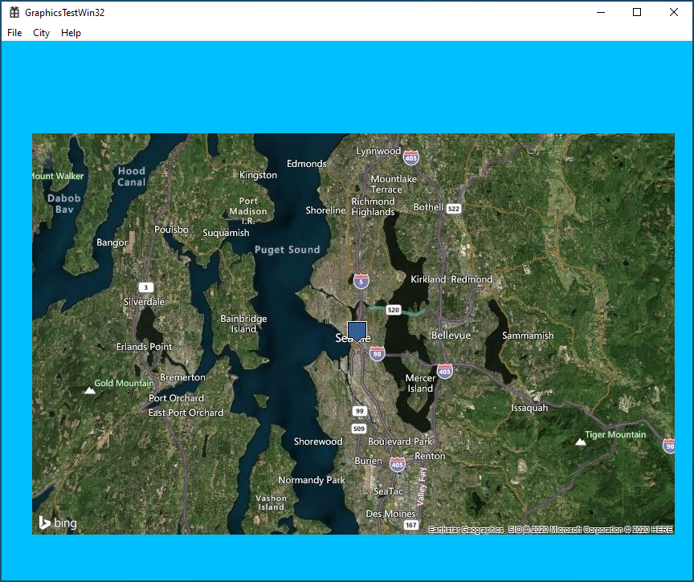
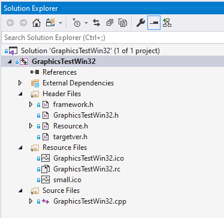
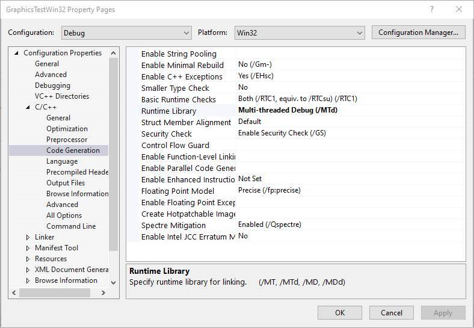
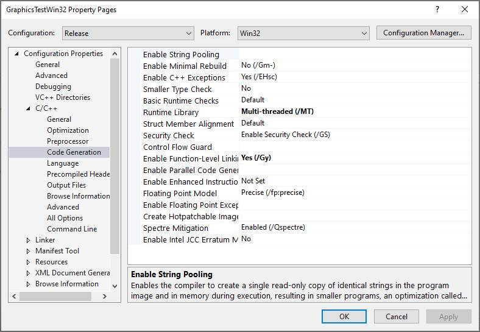

# Download and display Bing Maps with pure Win32
## Windows Developer Incubation and Learning - Paula Scholz

## Introduction

This project is an update of an earlier now-obsolete [version](https://www.codeproject.com/articles/170920/download-a-google-map-with-win32-c-and-wininet) published in 2011 for use on Windows CE devices.  In this revision for the Windows Desktop, we use the [Bing Maps Platform](https://www.microsoft.com/en-us/maps) to download and display a static map image in a pure [Win32 API](https://docs.microsoft.com/en-us/windows/win32/) application.  Using [WinInet](https://docs.microsoft.com/en-us/windows/win32/wininet/about-wininet), [Vectors](https://docs.microsoft.com/en-us/cpp/standard-library/vector-class?view=vs-2019) from the [Standard Template Library](https://docs.microsoft.com/en-us/cpp/standard-library/cpp-standard-library-reference?view=vs-2019), the [Windows Imaging Component](https://docs.microsoft.com/en-us/windows/win32/wic/-wic-about-windows-imaging-codec), and [Win32 GDI](https://docs.microsoft.com/en-us/windows/win32/gdi/windows-gdi), we open an Internet connection to download and display a [static Bing Map](https://docs.microsoft.com/en-us/bingmaps/rest-services/imagery/get-a-static-map) on desktop Windows.

To use the [Bing Maps APIs](https://docs.microsoft.com/en-us/bingmaps/rest-services/), you must have a [Bing Maps Key](https://docs.microsoft.com/en-us/bingmaps/getting-started/bing-maps-dev-center-help/getting-a-bing-maps-key).  These are easy to obtain and at the time of writing (April 2020) are free for development use.

## Visual Studio Solution
The Visual Studio solution is shown below:

All the relevant code is in the GraphicsTestWin32.cpp file.

## Compilation Options
To run alongside [Windows Runtime](https://docs.microsoft.com/en-us/windows/uwp/winrt-components/) components on Windows 10x or to be published on the [Windows Store](https://developer.microsoft.com/en-us/store/), your code must be compiled to use static libraries and not Dynamic Link Libraries.  This mainly affects the use of the [C-Runtime](https://docs.microsoft.com/en-us/cpp/c-runtime-library/windows-store-apps-the-windows-runtime-and-the-c-run-time?view=vs-2019).  

To set your compilation options to compile with the static C-Runtime libraries, you must change the default compilation options of newly-generated Visual Studio C++ projects, which use Dynamic Link Library C-Runtime by default.  This is accomplished by right-clicking on your project file and selecting the Properties option at the bottom of the Context menu.  

On the Configuration Properties dialog, expand the Code Generation tab under the C/C++ tree.  Static runtime libraries must be chosen for both Debug and Release builds by changing the default `Runtime Library` value from `Multi-threaded DLL` or `Multi-threaded Debug DLL` to `Multi-threaded` or `Multi-threaded Debug`.

For Debug builds:

For Release builds:

## ApiValidator

The [ApiValidator](https://docs.microsoft.com/en-us/windows-hardware/drivers/develop/validating-universal-drivers) tool is part of the [Windows Driver Kit](https://docs.microsoft.com/en-us/windows-hardware/drivers/download-the-wdk). This tool is used to validate that APIs used are valid for a Universal Windows driver, and works for Applications as well as drivers. Applications that are not reported as `Universal` will fail Windows Store testing and will not be published.

## Spectre Mitigation

To mitigate [Spectre variant 1](https://support.microsoft.com/en-us/help/4073757/protect-windows-devices-from-speculative-execution-side-channel-attack) security vulnerabilities, your code should be compiled with the [/QSpectre](https://docs.microsoft.com/en-us/cpp/build/reference/qspectre?view=vs-2019) option and linked with the appropriate runtime libraries, which are not installed by default but instead must be installed by using the `Visual Studio Installer`.  `Qspectre` compilation options are set on the same Code Generation page as the `Runtime Libraries`.

